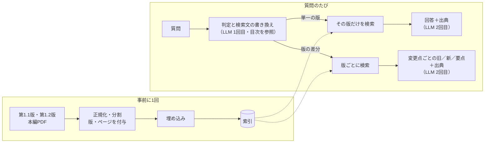

# AI事業者ガイドライン RAG Q&A

総務省・経済産業省「AI事業者ガイドライン」（第1.1版・第1.2版）に、**版とページの出典付き**で答えるRAG（検索拡張生成）のデモです。

- 「透明性のためにソースコードを公開する必要は？」のような質問に、根拠のページを示して答えます
- 「第1.2版で何が変わった？」のような**版の差分**の質問には、変更点ごとに旧版・新版の記載と出典を並べて答えます
- 想定するユースケースは、社内規程や業界ガイドラインの改訂時の「何が変わったか」「どこに書いてあるか」の確認作業の効率化です

LangChain の学習を目的に作成しました。作って終わりにせず、評価用の質問25問で**正答率・出典・コスト・応答時間を測り**、誤答の原因まで分析しています。

## デモ

**[https://ai-guideline-rag.onrender.com/](https://ai-guideline-rag.onrender.com/)**

試すとよい質問（画面の「質問の例を見る」からも入力できます）：

- 広島AIプロセスの「報告枠組み」に回答を提出・公表した組織はいくつありますか。そのうち日本企業は何社ですか。
- 第2部「D.」の章は、第1.1版から第1.2版でどう変わりましたか。対象となる事業者の範囲に注目して説明してください。
- 第1.2版では「AIエージェント」はどのように扱われるようになりましたか。

※ 無料プランのため、しばらくアクセスがないと最初の表示に1分ほどかかります。個人が学習目的で作成した**非公式**のデモです。回答は必ず[公式の原文](https://www.meti.go.jp/shingikai/mono_info_service/ai_shakai_jisso/20260331_report.html)で確認してください。

## 仕組み



| 役割 | 使ったもの |
| --- | --- |
| フレームワーク | LangChain v1（プロンプトテンプレート、構造化出力、ベクトルストア） |
| LLM | Claude Haiku 5.5（Anthropic API） |
| 埋め込み | bge-m3（Cloudflare Workers AI。無料枠で運用） |
| ベクトルストア | LangChain の InMemoryVectorStore（JSON で保存し、リポジトリに同梱） |
| 画面・公開 | Gradio、Render（GitHub の main への push で自動デプロイ） |
| 開発 | Python 3.12、uv、ruff、pytest |

## 評価

評価用の質問25問（[data/eval/questions.json](data/eval/questions.json)）を `scripts/eval.py` で通しで流した結果です（2026-10-11、改善前のベースライン）。正解とページは両方の版の本文で確認しています。

| 区分 | 問数 | 正答 | 検索（上位5件に正解のページ） | 1問の料金 | 平均秒 |
| --- | --- | --- | --- | --- | --- |
| 全体 | 25 | 20/25 | 22/23 | 0.12円 | 4.1 |
| 単一の版 | 12 | 8/12 | 12/12 | 0.09円 | 3.1 |
| 版の差分 | 11 | 10/11 | 10/11 | 0.15円 | 5.4 |
| 答えられないはずの質問 | 2 | 2/2 | - | 0.08円 | 2.9 |

- **誤った内容を言い切った回答は0件**でした。誤答5問は「分からない」と答えたか、エラーです
- 誤答の主な原因は、正解のページは検索できているのに、答えの部分（脚注や続きの項目）が同じページの別のチャンクにあり、LLM に渡っていないことでした（3問）。当たったチャンクの前後も渡す改善（small-to-big）で効果を確かめる予定です
- 1問あたり約0.12円なので、1,000問で約120円です（Haiku 5.5 の料金で計算）

正答の判定は必須キーワードを使った目安です。全記録は [data/eval/results/](data/eval/results/)、誤答の分析は [docs/roadmap.md](docs/roadmap.md) の「② 評価」にあります。

## 設計判断

| # | 判断 | 理由・比較 |
| --- | --- | --- |
| 1 | 全文を渡さず RAG にした | 今回の文書（2版で約7万トークン）は全文でも入力上限に収まる。それでも、文書が増えたときの拡張性、1問あたりのコスト、出典の追跡しやすさで RAG を選んだ。全文を渡す方式との比較は今後の課題 |
| 2 | 日本語向けの前処理を入れた | 第1.1版の PDF には見た目が同じ別の文字（「⽉」などの康熙部首）が混ざっており、NFKC 正規化で揃えた。PDF の折り返しによる文中の改行をつなぎ、分割の区切りに「。」「、」を追加して、文の途中で切れないようにした |
| 3 | チャンクは600文字・重なり100文字 | 300・600・1,000文字で検索のヒット率を比べ、1,000文字は悪化（複数の話題が混ざりベクトルがぼやける）。300と600は差が誤差の範囲だったため、渡す文脈が長い600を選んだ |
| 4 | 版ごとに分けて検索する | 第1.1版と第1.2版には同じ文が多く、そのまま検索すると古い版が混ざる。単一の版の質問はその版だけを、差分の質問は版ごとに検索して両方を並べる |
| 5 | 質問の判定と検索文の書き換えを1回の LLM 呼び出しで行う | 「第2部 D. の章は？」のように章の番号を指す質問は本文の言葉を含まず、検索で見つからなかった。目次を渡して見出しの言葉に書き換えさせると、圏外から1位になった。また版の名前（「第1.2版」）を含めて検索すると表紙が上位に来るため、版の名前は除く。検索には書き換えた文を、回答の LLM には元の質問を渡す |
| 6 | まず固定ワークフローで作る | 処理の順番をコードで決め、LLM には判定と回答だけを任せた。エージェント（LLM が次の行動を決める）にする前に、評価で比べられる土台を作るため。パターンとしてはルーティング（入力を分類して専用の処理に振り分ける） |
| 7 | 回答は構造化出力にする | 回答・出典（版とページ）・回答可否を決まった形で受け取り、画面表示と評価に使う。LLM が実際には渡していないページを出典に挙げた場合は検出する |
| 8 | 埋め込みは Workers AI の bge-m3 | 主な理由はコスト（無料枠で運用でき、有料の契約を LLM の1つに抑えられる）。多言語対応で日本語の評価も高い。定番の OpenAI text-embedding-3-small との比較は今後の課題 |
| 9 | 公開先は Render の無料プラン | Hugging Face Spaces は2026年夏から新規の Gradio アプリに有料プランが必要になり、Cloudflare は通常の Workers で Gradio が動かないため。画面とデプロイは試作を見せるための手段として作り込んでいない |

## 本番ならこう作る

今回は学習と試作のため、いくつかの部分を簡略化しています。業務で使う場合の構成例（AWS の場合）：

| 今回の試作 | 本番の構成例 | 理由 |
| --- | --- | --- |
| Gradio の画面 | React などのフロントエンド＋API Gateway | 社内システムとの統合、画面の作り込み |
| Render（無料プラン） | Lambda や ECS | 可用性、スリープなし、社内ネットワークとの接続 |
| Anthropic API を直接呼ぶ | Amazon Bedrock | 契約・請求・データの扱いを社内の AWS 環境にまとめられる |
| JSON の索引＋全件比較 | OpenSearch や Aurora（pgvector） | 文書の量、更新のしやすさ、権限による絞り込み |
| 1日の回数制限（メモリ上） | Cognito などによる認証と、利用者ごとの上限 | 利用者の特定と、使いすぎの防止 |
| 標準出力のログ | CloudWatch、トレーシング（Langfuse など） | 回答の監査、コストと応答時間の監視 |
| 手作業の評価 | 評価をCIに組み込み、プロンプトやモデルの変更ごとに実行 | 品質の劣化を変更前に検知する |

処理の本体（`src/ai_guideline_rag/`）は画面や実行環境と分けてあるため、`pipeline.ask()` を呼ぶ部分を差し替えれば、上の構成にも載せ替えられます。

## 導入時のリスクと対策

| リスク | 内容 | 対策 |
| --- | --- | --- |
| 索引からの情報漏えい | 索引ファイルには文書の元の文章がそのまま入る（ベクトルから元の文章を推測できるという研究もある） | 元の文書と同じ機密レベルで管理する。今回は公開文書なので GitHub に置いている |
| 外部 API へのデータ送信 | 索引作成時に文書の全文を埋め込み API へ、質問のたびに検索結果を LLM の API へ送る | 学習への利用の有無、保存期間を契約・規約で確認する。必要なら社内のクラウド環境（Bedrock など）や自前のモデルを使う |
| 誤った回答 | LLM が根拠のない内容を答える | 参照テキストだけを根拠にさせ、答えられなければ「分からない」と答えさせる。出典を必ず示し、渡していない出典を検出する。評価で「誤った内容を言い切った回答」を数え続ける |
| プロンプトインジェクション | 文書や質問に「前の指示を無視して…」のような文が含まれる | 参照テキスト内の指示に従わないようプロンプトで指示する。外部の文章（Web 検索の結果など）を加える場合は、最も信用できない入力として扱う |
| コストの増加・悪用 | 公開 URL から大量に質問されると課金が増える | 同時処理数・1日の回数・質問の長さを制限し、API の利用上限額を設定している |

## 既知の課題と今後

- 答えの部分が同じページの別のチャンクにあると取りこぼす（評価の誤答の主な原因）→ 当たったチャンクの前後も渡す
- ページの境目で文が切れる（チャンクをページ単位で作り、出典のページを1つに決めるための割り切り）
- 内容は答えられているのに「答えられない」と判定することがある → 部分的に答えられる場合の扱いを決める
- LLM の出力は実行ごとに揺れ、構造化出力の形に合わないことがまれにある → 複数回の評価、再試行
- 正答の判定がキーワードによる目安 → LLM に採点させる（LLM-as-a-judge）
- 今後の拡張：ハイブリッド検索（キーワード＋ベクトル）、埋め込みモデルの比較、LangGraph によるエージェント化（検索のやり直しや Web 検索の要否を LLM が判断する）

計画と進捗は [docs/roadmap.md](docs/roadmap.md) にあります。

---

## 開発者向け

### ファイル構成

`src/ai_guideline_rag/` に処理の部品（関数）、`scripts/` に各部品の動作確認とコマンドライン用のスクリプトを置いています。各ファイルの先頭に、設計の判断と学習メモを書いています。

| 工程 | 部品（`src/ai_guideline_rag/`） | 動作確認（`scripts/`） |
| --- | --- | --- |
| 設定 | `config.py`：パス・版・モデル名 | `check_env.py`：API の疎通確認 |
| ① 読み込み | `loader.py`：PDF → ページ単位の Document（NFKC 正規化、版・ページ） | `try_load.py` |
| ② 分割 | `splitter.py`：Document → チャンク（日本語の区切り文字、短い見出しは次のチャンクに結合） | `try_split.py` |
| ③ 索引 | `embeddings.py`・`index.py`：埋め込み、索引の作成・保存・読み込み（`data/index.json`） | `build_index.py` |
| ④⑤ 検索 | `retriever.py`：版で絞り込んだ検索（上位5件）、検索結果のコンテキスト整形、目次 | `try_search.py` |
| ⑥ 回答 | `answer.py`：プロンプト＋構造化出力で回答、渡していない出典の検出 | `ask.py` |
| 判定 | `router.py`：質問の種類（単一の版／差分）の判定と、検索用の文の書き換え | `try_route.py` |
| 差分 | `diff.py`：版ごとに検索し、変更点ごとに旧／新／要点と出典を回答 | `try_diff.py` |
| 流れ | `pipeline.py`：判定 → 単一の版の回答／版の差分の回答。画面と `ask.py` はここを呼ぶ | `ask.py` |
| 評価 | `evaluation.py`：評価用の質問の読み込み、正解ページの順位 | `eval.py` |
| 画面 | `app.py`（リポジトリ直下）：Gradio | `uv run python app.py` |

`scripts/hello_lang.py` は LangChain の練習用（チャットモデル、プロンプトテンプレート、構造化出力）です。

### セットアップ

Python のパッケージ管理に [uv](https://docs.astral.sh/uv/) を使います（Python 3.12 は uv が自動で用意します）。

```bash
uv sync
cp .env.example .env   # API キーを記入（Anthropic、Cloudflare Workers AI）
uv run python scripts/check_env.py
uv run python scripts/ask.py "質問"
uv run python scripts/eval.py --label 名前
```

題材の PDF は `data/pdf/` に置きます（Git には含めません）。索引（`data/index.json`）はリポジトリに含めているので、質問するだけなら PDF は不要です。

| ファイル | 内容 |
| --- | --- |
| `20250328_1.pdf` | 第1.1版 本編 |
| `20260331_1.pdf` | 第1.2版 本編 |
| `diff_ans_20260331_10.pdf` | 第1.2版 本編（第1.1版からの変更履歴付き）。評価の正解の確認用で、索引には入れない |

### デプロイ（Render）

GitHub の `main` へ push すると自動でデプロイされます。`uv.lock` があるため Render が uv を用意し、Python は `.python-version`（3.12）を使います。

| 項目 | 設定値 |
| --- | --- |
| Build Command | `uv sync --frozen --no-dev` |
| Start Command | `uv run --no-sync python app.py` |
| Environment Variables | `ANTHROPIC_API_KEY`、`CF_ACCOUNT_ID`、`CF_AI_API_TOKEN`（任意：`DAILY_LIMIT`） |

### 開発コマンド

```bash
uv run ruff check .
uv run ruff format .
uv run pytest
```

## 出典

総務省・経済産業省「AI事業者ガイドライン」（第1.1版 2025年3月28日、第1.2版 2026年3月31日）
https://www.meti.go.jp/shingikai/mono_info_service/ai_shakai_jisso/20260331_report.html
